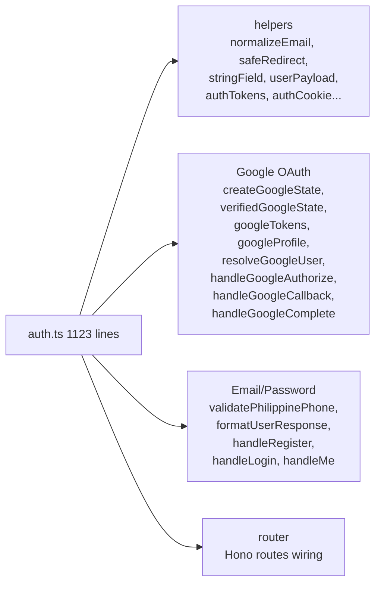
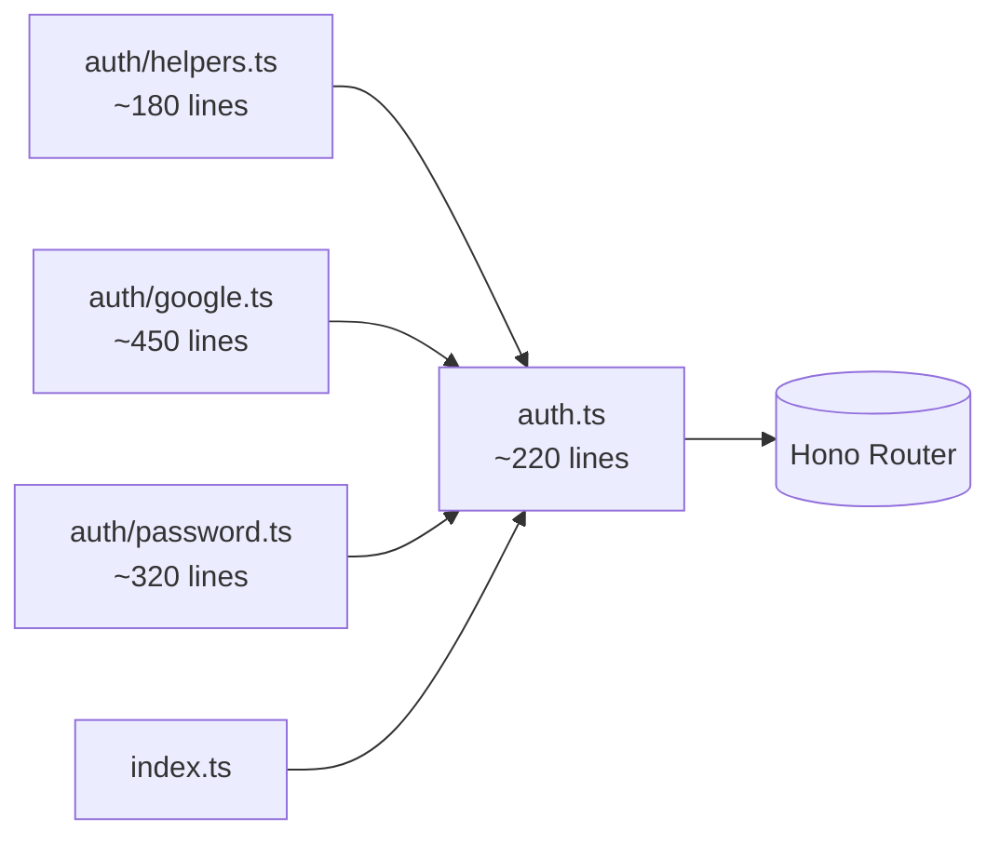
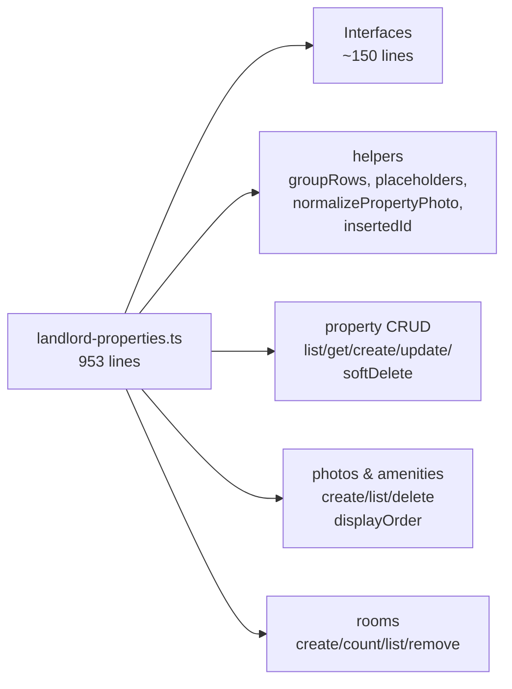
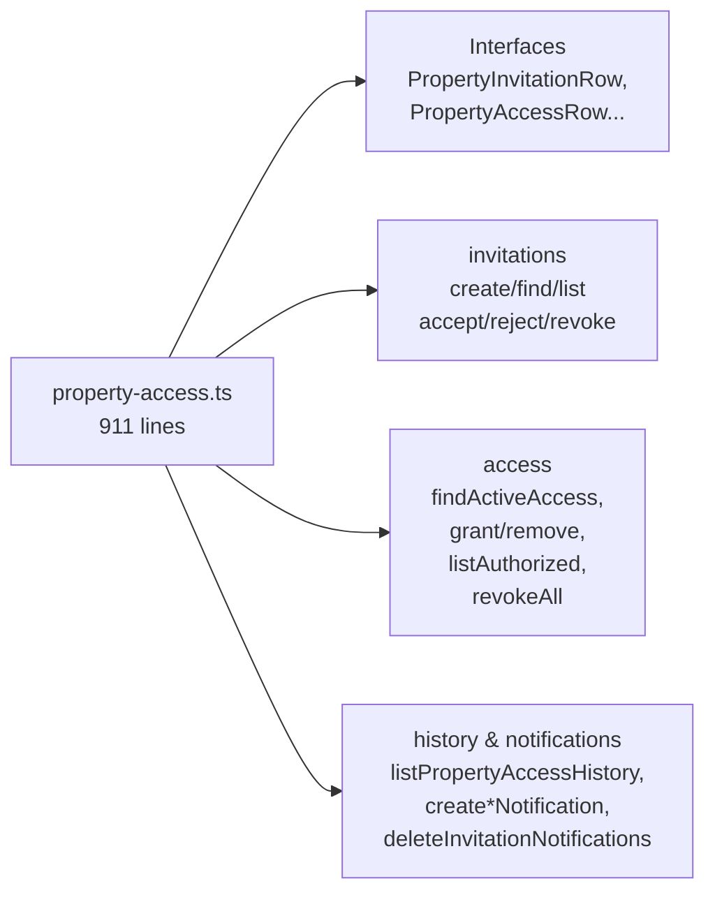
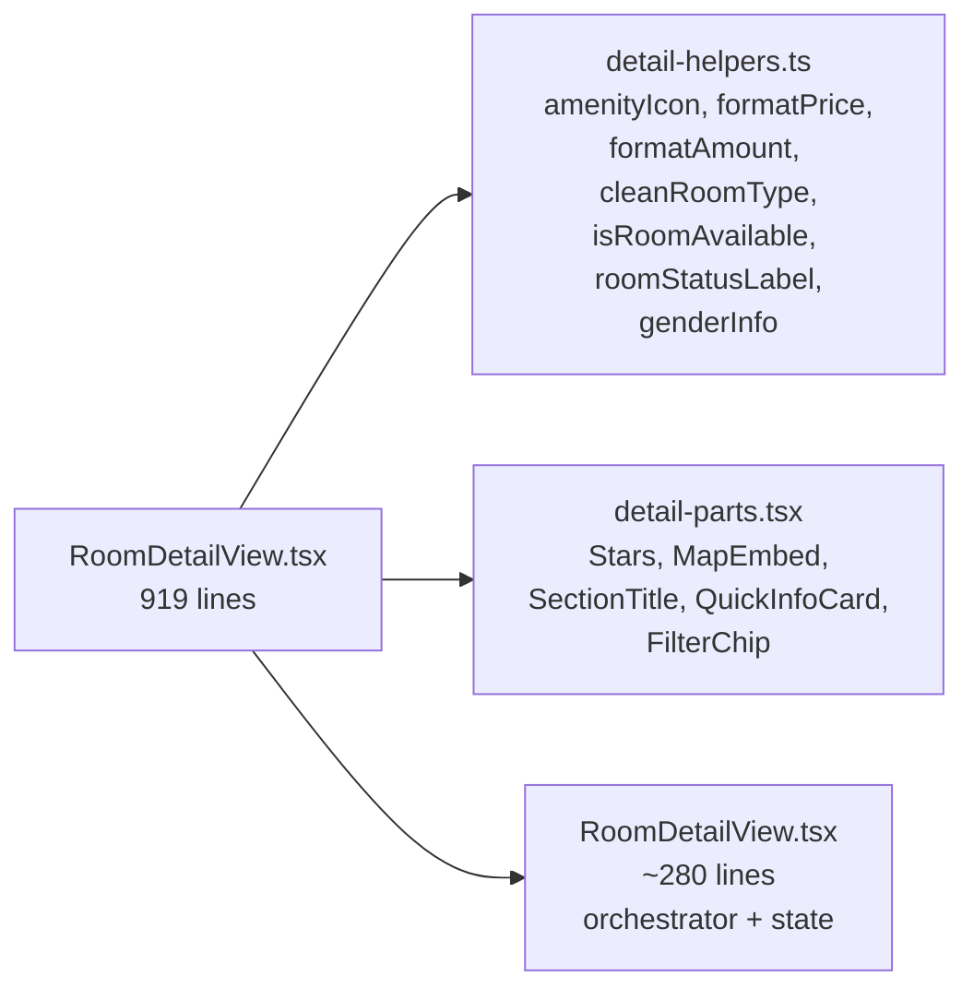
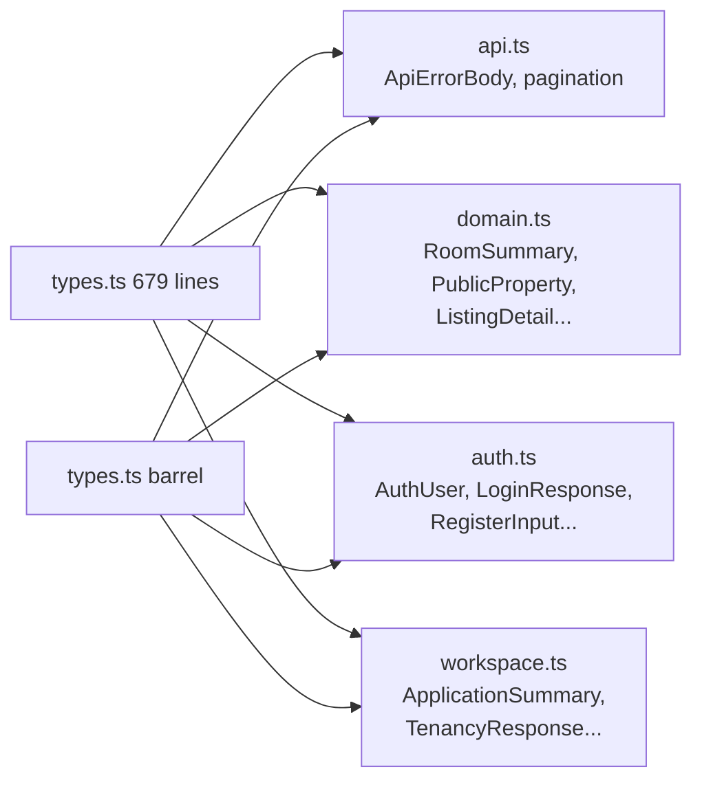

# Audit Report: haven-space

Generated: 2026-08-20
Scope: `C:/Users/Qwenzy/Desktop/haven-space` (monorepo: `apps/web` TanStack Start + `workers/api` Cloudflare Worker + legacy `client/` static frontend)
Excluded from metrics: `node_modules/`, `.git/`, `dist/`, `.wrangler/`, `.codegraph/`, `.tanstack/`

## Executive Summary

Haven Space is a healthy mid-size monorepo (~280 source files outside vendor) with two distinct eras coexisting: a modern `apps/web` + `workers/api` stack and a legacy `client/` static site (HTML/CSS/JS, ~98 TS files). The legacy era is the dominant source of structural debt: **76 files exceed the 400-line threshold**, of which **~45 belong to `client/js/views/`** and will never shrink — they should be archived, not split. The modern stack has **8 genuinely oversized files** (`auth.ts` 1123, `landlord-properties.ts` 953, `property-access.ts` 911, `RoomDetailView.tsx` 919, `types.ts` 679, `listings.ts` 720, etc.) that need surgical splits. Two asset folders are bloated at 77 files each (near-duplicate SVG dumps), a 67-file backup directory (`client/css.bak/`) is dead weight, and 42 markdown files are scattered with many placeholder READMEs. Nesting reaches 8 levels but is largely TanStack file-router convention, not an anti-pattern. Overall: **delete legacy weight first, then split 8 modern files, then reorganize assets/docs**.

## Severity Legend

- 🔴 **Blocker** — must fix (breaks the 400-line or 30-file contract, or is dead code at scale)
- 🟡 **Warning** — should fix (nearing threshold, causes confusion/maintenance cost)
- 🟢 **Suggestion** — nice to improve (naming polish, single-child chains, depth)

---

## Metrics Dashboard

| # | Metric | Threshold | Found | Worst Offender |
|---|--------|-----------|-------|----------------|
| 1 | Folder file count | >30 files/dir | 🔴 2 | `apps/web/public/assets/svg` — 77, `client/assets/svg` — 77 (near-duplicate) |
| 2 | File line count | >400 lines/file | 🔴 76 | `client/js/views/public/find-a-room.ts` — 2149, `client/js/views/landlord/create-listing.ts` — 2089 |
| 3 | Nesting depth | >4 levels | 🟡 26 dirs ≥5 | `apps/web/src/routes/landlord/listings/rooms/$id` — 8 levels |
| 4 | Naming conventions | single style/level | 🟢 Mixed | `*/assets/svg` — kebab + camelCase + snake_case + PascalCase + other intermingled |
| 5 | Orphaned/misplaced files | no misplacement | 🟡 3 classes | `setup.bat`/`setup.ps1` at root, `client/css.bak/`, duplicated `client/assets` ↔ `apps/web/public/assets` |
| 6 | Doc sprawl | ≤5 scattered .md | 🟢 42 files | 14 placeholder `README.md` under `client/css/` + `client/views/` |
| 7 | Empty/dead dirs | 0 | 🟢 0 empty, 5 single-child chains | `apps → web`, `workers → api`, `docs/superpowers → plans` |

---

## Issues Found

### Phase 1: Quick Cleanup
_Low effort, safe changes. No behavior change. Do this first to deflate the numbers._

#### 1.1 Remove dead backup directory `client/css.bak/` — 🔴 Blocker

- **Location:** `client/css.bak/` — 67 files, byte-identical to `client/css/`
- **Metric:** Metric 5 (orphaned/misplaced) + Metric 7 (dead dir). Dead code at scale inflates every scan (appeared as 24-file "second place" in landlord/boarder dirs).
- **Evidence:** `walkFiles('client/css.bak').length === 67`, `diff client/css/global.css client/css.bak/global.css` — identical. Not referenced by any import or HTML (grep `css.bak` → 0 hits outside its own README).
- **Risk if kept:** Confuses `grep`, doubles CSS review surface, pollutes file-count rankings.

**Before:**
```
client/
├── css/                 (67 files, live)
│   ├── global.css
│   ├── ai-components.css
│   ├── components/ (8 files)
│   └── views/ (53 files)
├── css.bak/             (67 files, DEAD — byte duplicate)
│   ├── global.css
│   ├── ai-components.css
│   ├── components/ (8 files)
│   └── views/ (53 files)
└── ...
```

**After (proposed):**
```
client/
├── css/                 (67 files, live — retained until legacy removal)
└── ...                  (css.bak/ deleted)
```

- [ ] **Delete `client/css.bak/` entirely** — `rm -rf client/css.bak/`. Verify: `grep -r "css.bak" --exclude-dir=node_modules` returns 0. No build or test refs depend on it.

---

#### 1.2 Eliminate duplicated asset trees `client/assets/` ↔ `apps/web/public/assets/` — 🔴 Blocker

- **Location:** `client/assets/svg` 77 ↔ `apps/web/public/assets/svg` 77; `client/assets/images` 13 ↔ `apps/web/public/assets/images` 13; overlap ≈ 131 ↔ 133 files, filenames overlap >95%.
- **Metric:** Metric 1 (both dirs trip >30) + Metric 5 (orphaned legacy copy). The modern app serves from `apps/web/public/assets/`; `client/assets/` is the legacy static-site copy.
- **Evidence:** `web/assets: 133 files, client/assets: 131 files`. Sample diff: `Haven_Space_Logo.png`, `add_listing.svg`, `LocationPin.svg` exist in both with identical content.
- **Decision:** Do **not** split either SVG folder yet — deduplicate first. Splitting a duplicated folder doubles work.

**Before:**
```
repo/
├── client/assets/               (131 files — legacy)
│   ├── svg/ (77 files)
│   └── images/ (54 files)
└── apps/web/public/assets/      (133 files — active)
    ├── svg/ (77 files)
    └── images/ (56 files)
```

**After (proposed) — Option A (recommended): keep modern, archive legacy:**
```
repo/
├── apps/web/public/assets/      (133 files — single source of truth)
│   ├── svg/
│   └── images/
└── client/assets/               (deleted — legacy static site archived per 1.4)
```
Option B if `client/` must stay briefly: replace `client/assets/` with a symlink or build-time copy script; never maintain two copies manually.

- [ ] **Deduplicate assets** — keep `apps/web/public/assets/` as canonical; delete `client/assets/` when `client/` is archived (see 1.4). If `client/` must survive one more milestone, add a one-way sync script `scripts/sync-assets.mjs` (`cp -r apps/web/public/assets/* client/assets/`) and enforce it in CI.

---

#### 1.3 Move misplaced root setup scripts — 🟢 Suggestion

- **Location:** `setup.bat`, `setup.ps1` at repo root (14-file root dir)
- **Metric:** Metric 5 (misplaced). Root should contain only `package.json`, `README.md`, `AGENTS.md`, `LICENSE`, config. Setup helpers belong in `scripts/`.
- **Evidence:** `scripts/` currently holds `build-pages.mjs` + `tools/md_to_pdf.py`. Setup scripts are install helpers, not top-level entry points. `docs/MANUAL.md` already documents setup via `bun install`.
- **Recommended action:** Standardize on one convention; prefer `scripts/` for all executable helpers.

**Before:**
```
repo/
├── setup.bat
├── setup.ps1
├── scripts/
│   ├── build-pages.mjs
│   └── tools/md_to_pdf.py
├── package.json
└── ...
```

**After (proposed):**
```
repo/
├── scripts/
│   ├── build-pages.mjs
│   ├── setup.bat              (moved)
│   ├── setup.ps1              (moved)
│   └── tools/md_to_pdf.py
├── package.json
└── ...
```

- [ ] **Move `setup.bat` + `setup.ps1` → `scripts/`** and update `docs/MANUAL.md` + `README.md` references. Keep a `DEPRECATED` stub at root for one release only if external docs link directly, otherwise delete root copies.

---

#### 1.4 Archive the legacy `client/` static frontend — 🔴 Blocker (structural keystone)

- **Location:** `client/` — 98 JS/TS view files, 67 CSS files, 131 assets, 20+ HTML views. ~100% of the 45 worst oversized files live here.
- **Metric:** Metric 2 (45/76 oversized files) + Metric 1 (2 bloated dirs) + Metric 6 (17 markdown files) all collapse to this one decision.
- **Evidence:** `apps/web` is the active TanStack Start frontend (per `AGENTS.md`). `client/` is the pre-migration static site: `client/js/views/boarder` 28 files, `client/js/views/landlord` 27 files, `client/css` 67 files. No modern route imports from `client/`; `apps/web/src/routes/` is the router. `client/` is still served/built nowhere in `package.json` scripts (`web:dev`, `web:build`, `pages:build` all target `apps/web`).
- **Why not split the 45 legacy files?** Splitting `find-a-room.ts` (2149) or `create-listing.ts` (2089) is wasted effort on dead code. The correct fix is **archive, not refactor**.

**Before:**
```
repo/
├── client/                      (legacy — ~260 files)
│   ├── js/views/boarder/* (28 files, 6 over 700 lines)
│   ├── js/views/landlord/* (27 files, 8 over 700 lines)
│   ├── js/views/public/* (9 files)
│   ├── css/ + css.bak/ (134 files)
│   ├── assets/ (131 files, duplicate)
│   └── views/ (HTML templates)
├── apps/web/                    (active — TanStack Start)
│   └── src/routes/* (~50 files)
└── workers/api/                 (active)
```

**After (proposed):**
```
repo/
├── _archive/
│   └── client-2026-08-legacy/   (git tag + tarball, NOT in main tree)
├── apps/web/                    (only frontend)
└── workers/api/
```

- [ ] **Archive `client/`** — `git tag archive/client-2026-08-legacy && git archive --format tar.gz -o _archive/client-legacy.tar.gz HEAD:client && rm -rf client/` (or `git mv client _archive/client-legacy` if history must stay browsable). Update `docs/MANUAL.md` to note archive location. Verify: `bun run web:build && bun run cf:api:test` green; `grep -r "client/" apps/web workers --include="*.ts" --include="*.tsx"` shows no active imports (expected 0).
- [ ] **Delete `client/css.bak/` prior or with this step** (see 1.1 — included).
- [ ] **Delete `client/assets/` prior or with this step** (see 1.2 — included).

> **Impact on the audit:** Archiving `client/` alone resolves **47 of 76** oversized files, **1 of 2** bloated folders, **17 of 42** scattered docs, and the `css.bak` dead dir. Remaining audit targets shrink to the modern stack, where splitting is actually worthwhile.

---

#### 1.5 Consolidate doc sprawl — 🟢 Suggestion

- **Location:** 42 `.md` files repo-wide. 14 are placeholder `README.md` under `client/css/views/*/`, `client/js/views/*/`, `client/views/*/` (many are empty or single-line scaffolds). Core docs are `docs/` (8 files) + root (`README.md`, `AGENTS.md`).
- **Metric:** Metric 6 — threshold >5 scattered `.md` outside `docs/`. Raw count is 42, but effective sprawl is 14 placeholders + 5 `client/*.md` summaries.
- **Evidence:** `client/js/README.md`, `client/css/README.md`, `client/css/views/boarder/README.md`, etc. — each 1–5 lines ("This directory contains..."). `docs/TODO.md` is 273B and duplicates `TODO` tracking elsewhere. `client/AGENTS.md` duplicates root `AGENTS.md`.
- **Recommended action:** Keep `docs/` as single source of truth; remove placeholder READMEs (they fail the "evidence over opinion" test — they carry no measured value).

**Before:**
```
repo/
├── README.md, AGENTS.md
├── docs/ (8 files — real specs)
├── client/
│   ├── AGENTS.md (duplicate)
│   ├── README.md, AI-FIXES-SUMMARY.md, BOARDER-COLOR-SYSTEM.md
│   ├── css/README.md + css/views/boarder/README.md + css/views/landlord/README.md + css/views/public/README.md
│   ├── js/README.md + js/views/boarder/README.md + js/views/landlord/README.md + js/views/public/README.md + js/views/admin/README.md
│   ├── views/boarder/README.md + views/landlord/README.md + views/public/README.md + views/admin/README.md
│   └── ...
└── workers/api/README.md, apps/web/public/assets/README.md
```

**After (proposed):**
```
repo/
├── README.md, AGENTS.md
├── docs/ (8 files + consolidated specs)
│   ├── archive/legacy-client-notes.md  (migrated from client/*.md if useful)
│   └── ...
├── workers/api/README.md
└── ... (all placeholder client/*/README.md deleted with client/ archive)
```

- [ ] **When archiving `client/` (1.4), migrate any non-placeholder content** from `client/AGENTS.md`, `AI-FIXES-SUMMARY.md`, `BOARDER-COLOR-SYSTEM.md` into `docs/archive/legacy-client-notes.md` if still relevant, otherwise drop.
- [ ] **Delete `docs/TODO.md`** (273B) — migrate entries to GitHub Issues or root `TODO` tracking.
- [ ] **Keep `workers/api/README.md` + `apps/web/public/assets/README.md`** — these are package-level docs, not sprawl.
- [ ] **Verify:** `find . -name "*.md" -not -path "*/node_modules/*" -not -path "*/.codegraph/*" | wc -l` drops from 42 to ~12 (root 2 + docs ~8 + workers 1 + web asset 1).

---

### Phase 2: File Refactoring
_Medium effort — split genuinely oversized modern-stack files. Each plan includes language-specific mechanics, target files, and import changes._

> **Prerequisite:** Complete Phase 1.4 (`client/` archive). All line counts below are for the modern stack only (post-archive). If you skip 1.4, every plan below still holds but you will carry ~45 additional legacy files that should not be split.

#### 2.1 Split `workers/api/src/routes/auth.ts` — 1123 lines — 🔴 Blocker

- **Threshold:** >400 lines (2.8× over). Largest file in the active codebase.
- **Structure:** 1 default export (`authRoutes`), ~44 functions. Natural boundaries are crisp: (a) helpers/pure utils, (b) Google OAuth flow, (c) email/password handlers.
- **Callers / blast radius:** Imported once in `workers/api/src/index.ts` as `authRoutes`. No internal cross-file imports from this file. Safe to split — consumers only see the default router export.
- **Language mechanics (TypeScript/Hono):** Extract pure functions to sibling modules; re-export the router. Hono routes stay registered identically; no API surface change.

**Mermaid — before:**


**Mermaid — after:**


**Proposed split:**

| New file | Lines | Contents (from `auth.ts`) | Exports |
|----------|-------|---------------------------|---------|
| `workers/api/src/routes/auth/helpers.ts` | ~180 | `normalizeEmail`, `isEmail`, `safeRedirectPath`, `stringField`, `missingRequired`, `userPayload`, `authTokens`, `authCookie`, `authResponse`, `googleStateCookie`, `redirectResponse`, `randomToken`, `configuredOrigins`, `parseOrigin`, `isLocalhostOrigin`, `allowFrontendOrigin`, `frontendOrigin`, `frontendUrl`, `authErrorRedirect`, `clearGoogleStateHeaders`, `oauthAction`, `oauthRole`, `googleRedirectUri`, `requireGoogleConfig`, `userHashPayload`, `boarderRedirectPath`, `redirectPathForUser` | named exports, no Hono |
| `workers/api/src/routes/auth/google.ts` | ~450 | `GoogleStatePayload`, `GoogleTokenResponse`, `GoogleProfileResponse`, `GooglePendingPayload`, `formatUserResponse`, `validatePhilippinePhone`, `createGoogleState`, `verifiedGoogleState`, `googleTokens`, `googleProfile`, `profileEmailVerified`, `splitGoogleName`, `resolveGoogleUser`, `createGooglePendingToken`, `pendingSessionRedirect`, `handleGoogleAuthorize`, `handleGoogleCallback`, `handleGoogleComplete` | named exports `handleGoogle*` + helpers |
| `workers/api/src/routes/auth/password.ts` | ~320 | `handleRegister`, `handleLogin`, `handleMe` (+ `formatUserResponse` share via `helpers` or `google.ts`) | named exports |
| `workers/api/src/routes/auth.ts` | ~220 | Re-exports + Hono route wiring only: `import { handleGoogleAuthorize, ... } from './auth/google.js'` etc., then `authRoutes.get/post(...)` | `default authRoutes` |

**Import changes:**

```ts
// Before (workers/api/src/routes/auth.ts is self-contained)
import { Hono } from 'hono';
// ... 1123 lines, all inline
export default authRoutes;

// After (workers/api/src/routes/auth.ts barrel)
import { Hono } from 'hono';
import * as helpers from './auth/helpers.js';
import { handleGoogleAuthorize, handleGoogleCallback, handleGoogleComplete } from './auth/google.js';
import { handleRegister, handleLogin, handleMe } from './auth/password.js';
// ... route wiring only
export default authRoutes;

// workers/api/src/index.ts — unchanged
import authRoutes from './routes/auth.js';
```

- [ ] **Split `workers/api/src/routes/auth.ts` → `auth/helpers.ts` + `auth/google.ts` + `auth/password.ts` + slim `auth.ts` barrel** (TypeScript: use `.js` extensions in imports per ESM, create `auth/` dir, move interfaces `GoogleStatePayload`, `GoogleTokenResponse`, `GoogleProfileResponse` into `google.ts`, shared `userPayload`/`authTokens` into `helpers.ts`).
- [ ] Verify: `bun run cf:api:typecheck` + `bun run cf:api:test -- --run workers/api/test/auth.test.ts` (837 lines, covers OAuth + password paths) green. Also `bun run cf:api:test -- --run workers/api/test/e2e-flow.test.ts` (full auth flow).

---

#### 2.2 Split `workers/api/src/repositories/landlord-properties.ts` — 953 lines — 🔴 Blocker

- **Threshold:** >400 (2.4× over). 43 exports, 31 functions. Two distinct domains: **property CRUD** vs **photos/amenities/rooms**.
- **Callers:** `workers/api/src/routes/landlord/listings.ts`, `properties.ts`, `rooms.ts`, tests `landlord.test.ts`, `landlord-rooms.test.ts`, `property-access.test.ts`.
- **Mechanics:** Extract photo/amenity/room helpers to submodules; keep property core in place; barrel re-export to avoid churn.



**Proposed split:**

| New file | Contents |
|----------|----------|
| `workers/api/src/repositories/landlord/properties-core.ts` | `LandlordProperty*Row` interfaces + `listLandlordProperties`, `createLandlordProperty*`, `findLandlordPropertyForUpdate`, `getLandlordPropertyDetail`, `updateLandlordProperty`, `softDeleteLandlordProperty*`, `getLandlordAddress`, `updateLandlordAddress` |
| `workers/api/src/repositories/landlord/properties-photos.ts` | `LandlordPhotoRow`, `PropertyPhotoDisplayOrderRow`, photo/amenity fns: `listLandlordAmenities`, `listLandlordPhotos`, `createLandlordAmenity`, `deleteLandlordAmenities`, `getMaxPropertyPhotoDisplayOrder`, `createLandlordPropertyPhoto`, `listLandlordPropertyPhotoUrls`, `deleteLandlordPropertyPhotoByUrl`, `updateLandlordPropertyPhotoOrder` |
| `workers/api/src/repositories/landlord/properties-rooms.ts` | `LandlordRoomCountRow`, `LandlordRoomIdRow`, `CreateLandlordRoomInput`, `countLandlordRooms`, `listLandlordRoomIdsForRemoval`, `softDeleteLandlordRoomsById`, `updateLandlordActiveRooms`, `createLandlordRoom` |
| `workers/api/src/repositories/landlord-properties.ts` | **Barrel (compat):** `export * from './landlord/properties-core.js'; export * from './landlord/properties-photos.js'; export * from './landlord/properties-rooms.js';` |

- [ ] **Split `landlord-properties.ts` → `landlord/properties-core.ts` + `properties-photos.ts` + `properties-rooms.ts` + barrel** — keep `landlord-properties.ts` as barrel during migration to avoid touching every caller; delete barrel in follow-up once callers migrate to direct imports.
- [ ] Verify: `bun run cf:api:typecheck` + `bun run cf:api:test -- --run landlord.test.ts landlord-rooms.test.ts landlord-photos.test.ts property-access.test.ts`

---

#### 2.3 Split `workers/api/src/repositories/property-access.ts` — 911 lines — 🔴 Blocker

- **Threshold:** >400 (2.3×). 37 exports, 26 functions. Three domains: **invitations**, **access grants**, **history/notifications**.
- **Callers:** `workers/api/src/routes/landlord/invitations.ts`, `properties.ts`, `admin.ts`, `property-access.test.ts` (1155 lines).
- **Mechanics:** Same TypeScript barrel pattern as 2.2.



| New file | Contents |
|----------|----------|
| `workers/api/src/repositories/property-access/invitations.ts` | `PropertyInvitationRow`, `PendingInvitationRow`, `InvitationListItemRow`, `CreatePropertyInvitationInput`, `createPropertyInvitation`, `findPropertyInvitation`, `findPendingInvitation`, `listInvitationsForInvitee`, `listPendingInvitationsForProperty`, `acceptPropertyInvitation`, `rejectPropertyInvitation`, `revokePropertyInvitation` |
| `workers/api/src/repositories/property-access/grants.ts` | `PropertyAccessRow`, `InviteeLandlordRow`, `PropertyForAccessRow`, `AuthorizedLandlordRow`, `PropertyAccessOverviewRow`, `accessiblePropertyClause`, `findActiveAccess`, `findInviteeLandlord`, `findPropertyForAccess`, `listAuthorizedLandlords`, `listAccessiblePropertyIds`, `listPropertyAccessOverview`, `grantPropertyAccess`, `removePropertyAccess`, `countLandlordCreatedData`, `revokeAllFor*` |
| `workers/api/src/repositories/property-access/history.ts` | `AccessHistoryEvent*`, `listPropertyAccessHistory`, `createPropertyInvitationNotification`, `deleteInvitationNotifications`, `createPropertyAccessRemovedNotification` |
| `workers/api/src/repositories/property-access.ts` | Barrel re-export (`export * from './property-access/invitations.js'` etc.) |

- [ ] **Split `property-access.ts` → `property-access/{invitations,grants,history}.ts` + barrel**
- [ ] Verify: `bun run cf:api:typecheck` + `bun run cf:api:test -- --run property-access.test.ts`

---

#### 2.4 Split `apps/web/src/components/rooms/RoomDetailView.tsx` — 919 lines — 🔴 Blocker

- **Threshold:** >400 (2.3×). Single export `RoomDetailView` (155→878), but 16 helper functions/classes and 3 sub-components (`SectionTitle`, `QuickInfoCard`, `FilterChip`) tacked on.
- **Callers:** `apps/web/src/routes/boarder/find-a-room/$id/index.tsx`, `apps/web/src/routes/rooms/$id.tsx`, `find-a-room/index.tsx`
- **Mechanics (React/TypeScript):** Extract pure helpers to `rooms/detail-helpers.ts`, inline UI pieces to `rooms/detail-parts.tsx`, keep orchestrator thin.



| New file | Lines | Contents |
|----------|-------|----------|
| `apps/web/src/components/rooms/detail-helpers.ts` | ~120 | `amenityIcon`, `capitalize`, `formatPrice`, `formatAmount`, `cleanRoomType`, `isRoomAvailable`, `roomStatusLabel`, `genderInfo` — pure, testable |
| `apps/web/src/components/rooms/detail-parts.tsx` | ~250 | `Stars`, `MapEmbed`, `SectionTitle`, `QuickInfoCard`, `FilterChip` — presentational |
| `apps/web/src/components/rooms/RoomDetailView.tsx` | ~280 | `RoomDetailView` orchestrator: state, `useMemo` for images/filteredRooms, carousel logic — imports from `detail-helpers` + `detail-parts` |

- [ ] **Split `RoomDetailView.tsx` → `detail-helpers.ts` + `detail-parts.tsx` + slim `RoomDetailView.tsx`**
- [ ] Verify: `bun run web:typecheck` + `bun run web:test` (or manual `vite build` smoke: `bun run web:build`).

---

#### 2.5 Split `apps/web/src/lib/types.ts` — 679 lines — 🟡 Warning

- **Threshold:** >400 (1.7×). 79 exported interfaces, 0 functions — pure type barrel. Violates single-responsibility: API types, auth types, application/tenancy types, and domain entities all in one file.
- **Callers:** ~30 files via `import { ... } from '@/lib/types'` / `~/lib/types` — every route + component.
- **Mechanics:** Domain-split with barrel re-export so existing imports stay green.



| New file | Contents |
|----------|----------|
| `apps/web/src/lib/types/domain.ts` | `RoomSummary`, `PublicProperty`, `PublicListingsResponse`, `RoomDetail`, `ListingDetail`, `SimilarProperty`, `PopularLocation`, `LandlordProperty*` |
| `apps/web/src/lib/types/auth.ts` | `AuthUser`, `LoginResponse`, `RegisterInput`, `RegisterResponse`, `MeResponse`, `CheckEmailResponse`, `ProfileResponse`, `UpdateProfileInput` |
| `apps/web/src/lib/types/workspace.ts` | `ApplicationSummary`, `ApplicationsResponse`, `TenancyResponse`, `LeaveRequestInput`, `OnboardingStatusResponse`, `Announcement`, `DashboardStatsResponse`, `SavedStatusResponse` |
| `apps/web/src/lib/types/api.ts` | `ApiErrorBody`, generic pagination wrappers |
| `apps/web/src/lib/types.ts` | **Barrel:** `export * from './types/domain.js'; export * from './types/auth.js'; ...` — no breaking change |

- [ ] **Split `types.ts` → `types/{domain,auth,workspace,api}.ts` + barrel** — preserve import path `~/lib/types` via barrel. Optionally add `~/lib/types/domain` direct imports for new code.
- [ ] Verify: `bun run web:typecheck` (covers all consumers).

---

#### 2.6 Split `apps/web/src/routes/admin/index.tsx` — 458 lines + `apps/web/src/components/admin/PropertyAccessTab.tsx` — 413 lines — 🟡 Warning

- **Threshold:** Both >400. Admin dashboard is a page + tab co-pair; `PropertyAccessTab.tsx` is already separated but the page itself still carries 458 lines of dashboard wiring.
- **Callers:** TanStack file-router (`admin/index.tsx` is the route file); `PropertyAccessTab` is imported by it.
- **Mechanics:** Extract data hooks + table logic.

| New file | Contents |
|----------|----------|
| `apps/web/src/routes/admin/hooks.ts` | Data fetching: `useAdminDashboard`, `usePropertyAccessOverview` (extracted from `index.tsx` effects) |
| `apps/web/src/components/admin/AdminStats.tsx` | Stats cards (extracted from `admin/index.tsx` JSX) |
| Keep `apps/web/src/routes/admin/index.tsx` | ~180 lines: route shell, tab state, composition |
| Keep `apps/web/src/components/admin/PropertyAccessTab.tsx` | 413 → ~220 after extracting `access-table.tsx` subcomponent if needed |

- [ ] **Slim `admin/index.tsx` → extract `admin/hooks.ts` + `admin/AdminStats.tsx`** — keep `PropertyAccessTab.tsx` as-is or split its table rows into `property-access-table.tsx` if second pass needed.

---

#### 2.7 Triage remaining modern-stack oversized files (400–800 lines) — 🟡 Warning batch

After the 6 splits above, these files still exceed 400 but are lower priority (1.0–1.9× over). Fix opportunistically or on next touch:

| File | Lines | Suggested split | Effort |
|------|-------|---------------|--------|
| `workers/api/src/routes/landlord/listings.ts` | 720 | Extract `listings/validation.ts` (zod schemas) + `listings/handlers.ts` (per-route handlers); keep `listings.ts` as router barrel | S |
| `apps/web/src/components/rooms/FindARoomContent.tsx` | 711 | Extract filter state to `find-a-room/filters.ts` (hook) + `find-a-room/results.tsx` (list) | S |
| `workers/api/src/routes/account.ts` | 660 | Split `account/profile.ts` (get/update) + `account/password.ts` (change/reset) + `account/onboarding.ts` | S |
| `workers/api/src/routes/admin.ts` | 634 | Extract `admin/handlers.ts` per admin table/tab | S |
| `workers/api/src/routes/ai.ts` | 621 | Extract `ai/guest-limit.ts` + `ai/chat.ts` | S |
| `workers/api/src/repositories/account.ts` | 610 | Split `account/profile.ts` + `account/auth.ts` | S |
| `workers/api/src/repositories/listings.ts` | 601 | Split `listings/queries.ts` + `listings/mappers.ts` | S |
| `workers/api/src/repositories/tenancy.ts` | 508 | Split `tenancy/queries.ts` + `tenancy/status.ts` | S |
| `workers/api/src/repositories/announcements.ts` | 506 | Already focused — consider inline, or split `announcements/queries.ts` if grows | S (defer) |
| `workers/api/src/routes/rooms.ts` | 413 | Trim or extract `rooms/filters.ts` (query builder) | XS |

- [ ] **Batch-triage 400–800-line files** — apply the per-file split notes on next feature touch; no dedicated migration sprint required. Each split should follow the same barrel pattern (TypeScript ESM `*.js` imports) to keep diffs small.

---

#### 2.8 Generated file — do not split

- **Location:** `apps/web/src/routeTree.gen.ts` — 1577 lines, **generated** by `@tanstack/router-plugin`. Also `apps/web/worker-configuration.d.ts` — 16536 lines, **generated** by `wrangler types`.
- **Recommended action:** **Exclude from line-count metrics.** Add `routeTree.gen.ts` to lint/typecheck exclusions where noisy, and document as generated in `apps/web/README.md` or `.gitattributes` (`routeTree.gen.ts linguist-generated=true`). Never edit by hand.

---

### Phase 3: Structural Refactoring
_Higher effort — reorganize folders, flatten nesting, fix naming._

#### 3.1 Split bloated SVG asset folders — 🟡 Warning

- **Location:** `apps/web/public/assets/svg` — 77 files, `client/assets/svg` — 77 (duplicate, resolved by 1.2). Post-dedup, single active folder still holds 77 files (>30).
- **Threshold:** >30 files/dir (2.6× over). SVGs are flat asset dumps; no code imports break if subfoldered.
- **Proposed after dedup (single canonical dir):**

**Before:**
```
apps/web/public/assets/svg/          (77 files — flat)
├── add_listing.svg, aircon.svg, alert.svg, ameneties.svg, ...
├── apple-dark-logo.svg, arrowDownTray.svg, bookmark.svg, building.svg
├── LocationPin.svg, Kitchen.svg, Laundry.svg, Toilet.svg, ViewOffSlashIcon.svg
├── monthly_revenue.svg, occupancy_rate.svg, payment_side.svg
└── ... (73 more, 5 naming styles intermingled)
```

**After (proposed):**
```
apps/web/public/assets/svg/
├── ui/               (navigation & chrome)
│   ├── chevron-down.svg, chevron-left.svg, chevron-right.svg
│   ├── arrowDownTray.svg, close.svg, check.svg, checkSimple.svg, eye.svg
│   ├── search.svg, magnifier.svg, plus.svg, bookmark.svg
│   ├── home.svg, dashboard.svg, settings.svg, user.svg, users.svg, logout.svg
│   └── notification.svg, messages.svg, calendar.svg, clock.svg
├── property/         (listing domain)
│   ├── building.svg, property.svg, location.svg, LocationPin.svg
│   ├── Kitchen.svg, Laundry.svg, Toilet.svg, parking.svg, cctv.svg
│   ├── furnished.svg, aircon.svg, wfifi.svg, bed/bath icons
│   └── placeholder-room.svg
├── finance/          (payments & revenue)
│   ├── payment.svg, payment_side.svg, currencyDollar.svg, creditCard.svg
│   ├── monthly_revenue.svg, occupancy_rate.svg, printer.svg, export.svg
│   └── cash-payment-icon-5.png (move raster to images/finance/)
└── brand/            (logos & social)
    ├── apple-dark-logo.svg, google-icon-logo.svg, Haven_Space_Logo.png
    ├── instagram-logo.svg, ViewOffSlashIcon.svg
    └── favicon.svg
```

- [ ] **Categorize `svg/` into `ui/`, `property/`, `finance/`, `brand/`** (4 buckets, each 10–25 files, under threshold). Update import/URL refs: `grep -r "\.svg" apps/web/src --include="*.ts" --include="*.tsx"` — many SVGs are referenced by string URL (`/assets/svg/<name>`), so add a `paths.ts` alias or keep a compat symlink/shim for one release.
- [ ] **Normalize SVG filenames to kebab-case** in the same pass (see 3.4).

---

#### 3.2 Address deep nesting (8 levels) — 🟢 Suggestion (largely by convention)

- **Location:** `apps/web/src/routes/landlord/listings/rooms/$id` — 8 levels; `boarder/find-a-room/$id` — 7; `landlord/listings/$id` — 7. Also `apps/web/src/components/onboarding/boarder` — 6.
- **Threshold:** >4 levels flagged 26 dirs, but TanStack file-router **requires** directory-per-segment routing — depth is idiomatic, not accidental.
- **Evidence:** `apps/web/src/routes/landlord/listings/rooms/$id/edit.tsx` — depth 8 is `routes / landlord / listings / rooms / $id / edit.tsx` (5 dir levels + `routes` prefix). This is expected. The actual concern is **route count**, not depth: `landlord/` has 16 files (flat would be worse).
- **Recommended action:** **No flattening.** Document that depth is router-convention. Only act if a non-routes path exceeds depth.

**No action required** — annotate in this audit as "by design".

- [ ] **Mark nesting as by-design for `apps/web/src/routes/`** — add note to `AGENTS.md` or `docs/superpowers/plans/*` that TanStack file-router nesting is exempt from the 4-level rule. Enforce 4-level limit only for non-routes trees (`components/`, `lib/`, `workers/api/src/`).
- [ ] **Verify non-routes depth:** `apps/web/src/components/onboarding/boarder` (6) is the deepest non-routes path — acceptable (2 wrapper + 1 domain). No action.

---

#### 3.3 Flatten/reorganize `client/js/views/` & `client/js/shared/` — 🟢 Suggestion (resolved by archive)

- **Location:** `client/js/views/boarder` 28 files, `client/js/views/landlord` 27 files, `client/js/shared` 20 files — all under threshold individually but collectively a 75-file flat dump with 1 level of categorization.
- **Threshold:** Not over 30 per-dir, but **organization by role (boarder/landlord) without sub-domain grouping** forces 28-file scans per task. Modern counterpart `apps/web/src/routes/` uses sub-domains (`payments/`, `listings/`, `find-a-room/`) effectively.
- **Recommended action:** **Resolved by Phase 1.4 archive.** If `client/` must outlive one release, group by subdomain similarly to `apps/web`:

**Before (legacy):**
```
client/js/views/
├── boarder/   (28 files — flat)
│   ├── applications-dashboard.ts (1325)
│   ├── boarder-payments-init.ts (1477)
│   ├── boarder-find-a-room.ts (1445)
│   └── ... (25 more)
└── landlord/  (27 files — flat)
```

**After (if retention required — NOT recommended):**
```
client/js/views/
├── boarder/
│   ├── applications/  (applications-dashboard.ts, boarder-applications.ts logic)
│   ├── payments/      (boarder-payments-init.ts, payments-page.ts, ...)
│   ├── rooms/         (room-detail.ts, room-detail-fix.ts, boarder-find-a-room.ts)
│   └── shared/
└── ...
```

- [ ] **No action if `client/` is archived (1.4)** — this issue resolves automatically.
- [ ] **If retention required:** sub-group `boarder/` and `landlord/` into `{applications,payments,rooms,listings}/` mirroring `apps/web` routes.

---

#### 3.4 Normalize naming conventions in `assets/svg` + `assets/images` — 🟢 Suggestion

- **Location:** `apps/web/public/assets/svg` + `apps/web/public/assets/images` — 4 casing styles intermingled at the same level.
- **Evidence:**
  - `svg/`: `chevron-down.svg` (kebab), `arrowDownTray.svg` (camel), `add_listing.svg` (snake), `Kitchen.svg` (Pascal), `aircon.svg` (lower)
  - `images/`: `cash-payment-icon-5.png` (kebab), `bank_icon.png` (snake), `Haven_Space_Logo.png` (mixed), `PrimeRealEstate.webp` (Pascal), `ChatGPT Image May 10, 2026, 11_12_52 PM.jpg` (spaces + commas — illegal in URLs)
- **Recommended action:** Standardize on **kebab-case** for all public assets (project convention per `AGENTS.md`). Rename in one pass with a mapping file.

- [ ] **Rename assets to kebab-case** — e.g., `arrowDownTray.svg` → `arrow-down-tray.svg`, `add_listing.svg` → `add-listing.svg`, `Kitchen.svg` → `kitchen.svg`, `bank_icon.png` → `bank-icon.png`, `Haven_Space_Logo.png` → `haven-space-logo.png`, `ChatGPT Image May 10, 2026, 11_12_52 PM.jpg` → `chatgpt-image-2026-05-10.jpg`. Keep a compat alias map in `apps/web/src/lib/paths.ts` for one release if URLs are hardcoded.

---

#### 3.5 Reorganize `scripts/` + `workers/api/migrations/` — 🟢 Suggestion

- **Location:** `scripts/` — 1 file (`build-pages.mjs`) + 1 subdir (`tools/` with `md_to_pdf.py`). `workers/api/migrations/` — 16 SQL files, one duplicate prefix (`0014_property_access.sql` + `0014_seed_sample_listings.sql` both claim 0014).
- **Evidence:** `scripts/build-pages.mjs` is the Pages bundle assembler; no other script is categorized. `0014` duplicate numbering risks migration ordering confusion (D1 applies lexicographically).
- **Recommended action:**

**Before:**
```
scripts/
├── build-pages.mjs
└── tools/
    └── md_to_pdf.py

workers/api/migrations/
├── 0001_users_auth.sql ... 0013_*.sql
├── 0014_property_access.sql
├── 0014_seed_sample_listings.sql   (collision)
└── 0015_onboarding_fields.sql
```

**After (proposed):**
```
scripts/
├── build/
│   └── build-pages.mjs
├── setup/
│   ├── setup.bat                   (from 1.3)
│   └── setup.ps1
└── tools/
    └── md_to_pdf.py

workers/api/migrations/
├── 0001_users_auth.sql ... 0013_*.sql
├── 0014_property_access.sql
├── 0015_seed_sample_listings.sql   (renamed — was 0014)
└── 0016_onboarding_fields.sql      (renamed — was 0015)
```

- [ ] **Categorize `scripts/` into `build/`, `setup/`, `tools/`** (move `build-pages.mjs` → `scripts/build/build-pages.mjs` with compat re-export; move `setup.*` per 1.3).
- [ ] **Fix migration numbering collision:** rename `0014_seed_sample_listings.sql` → `0015_seed_sample_listings.sql` and `0015_onboarding_fields.sql` → `0016_onboarding_fields.sql` (or insert as `0014b`). Verify `wrangler d1 migrations list` is ordered. **Warning:** renaming an applied migration requires a follow-up migration, not a rewrite, if it has already run in production — check `d1_migrations` table before renaming.

---

## Refactoring Progress

Use this checklist to track completion. Mark `[x]` when a task is done:

**Phase 1 — Quick Cleanup (6 items):**

- [ ] 1.1 Delete `client/css.bak/` (67 files)
- [ ] 1.2 Deduplicate `client/assets/` ↔ `apps/web/public/assets/` (or with 1.4)
- [ ] 1.3 Move `setup.bat`/`setup.ps1` → `scripts/setup/`
- [ ] 1.4 Archive `client/` legacy frontend (~260 files, resolves 47 oversized files)
- [ ] 1.5a Migrate useful `client/*.md` content → `docs/archive/`
- [ ] 1.5b Delete placeholder `client/*/README.md` (with 1.4) + `docs/TODO.md`

**Phase 2 — File Refactoring (8 items):**

- [ ] 2.1 Split `workers/api/src/routes/auth.ts` (1123 → ~220 + 3 modules)
- [ ] 2.2 Split `workers/api/src/repositories/landlord-properties.ts` (953 → barrel + 3 modules)
- [ ] 2.3 Split `workers/api/src/repositories/property-access.ts` (911 → barrel + 3 modules)
- [ ] 2.4 Split `apps/web/src/components/rooms/RoomDetailView.tsx` (919 → ~280 + 2 modules)
- [ ] 2.5 Split `apps/web/src/lib/types.ts` (679 → barrel + 4 domain modules)
- [ ] 2.6 Slim `apps/web/src/routes/admin/index.tsx` (458 → hooks + stats)
- [ ] 2.7 Triage remaining 400–800-line batch (10 files, on-touch)
- [ ] 2.8 Mark `routeTree.gen.ts` + `worker-configuration.d.ts` as generated (exclude)

**Phase 3 — Structural Refactoring (5 items):**

- [ ] 3.1 Categorize `apps/web/public/assets/svg/` into `ui/`, `property/`, `finance/`, `brand/`
- [ ] 3.2 Document TanStack router nesting exemption (no code change)
- [ ] 3.3 Sub-group `client/js/views/` (resolved by 1.4 — no action if archived)
- [ ] 3.4 Normalize asset filenames to kebab-case
- [ ] 3.5 Reorganize `scripts/` + fix migration numbering collision

> **⚠️ Before implementing any Phase 2/3 split, use `skill:test-driven-development`.** Write characterization tests for existing behavior first (many oversized files already have coverage — `auth.test.ts` 961, `landlord.test.ts` 881, `property-access.test.ts` 1155), then refactor. Verify with `bun run cf:api:typecheck`, `bun run cf:api:test`, `bun run web:typecheck`, `bun run web:build`.

---

## Appendix A: Full Oversized-File Inventory (post-`client/` archive — modern stack only)

> 76 files exceed 400 lines repo-wide. Filtering to **active code** (excluding `client/`, generated files, `.tanstack/`, `worker-configuration.d.ts`) leaves **18 modern-stack files** + `routeTree.gen.ts` (generated). Table below is the actionable set. Full legacy list available via `Get-ChildItem -Recurse -Include *.ts,*.tsx,*.js -Exclude routeTree.gen.ts | Where-Object Lines -gt 400`.

| # | File | Lines | Severity | Phase | Notes |
|---|------|------:|----------|-------|-------|
| 1 | `workers/api/src/routes/auth.ts` | 1123 | 🔴 | 2.1 | Split into helpers/google/password |
| 2 | `workers/api/src/repositories/landlord-properties.ts` | 953 | 🔴 | 2.2 | Split into core/photos/rooms |
| 3 | `apps/web/src/components/rooms/RoomDetailView.tsx` | 919 | 🔴 | 2.4 | Extract helpers + parts |
| 4 | `workers/api/src/repositories/property-access.ts` | 911 | 🔴 | 2.3 | Split into invitations/grants/history |
| 5 | `workers/api/src/routes/landlord/listings.ts` | 720 | 🟡 | 2.7 | Validation + handlers |
| 6 | `apps/web/src/components/rooms/FindARoomContent.tsx` | 711 | 🟡 | 2.7 | Filters + results |
| 7 | `apps/web/src/lib/types.ts` | 679 | 🟡 | 2.5 | Domain barrels |
| 8 | `workers/api/src/routes/account.ts` | 660 | 🟡 | 2.7 | Profile/password/onboarding |
| 9 | `workers/api/src/routes/admin.ts` | 634 | 🟡 | 2.7 | Per-tab handlers |
| 10 | `workers/api/src/routes/ai.ts` | 621 | 🟡 | 2.7 | Guest-limit + chat |
| 11 | `workers/api/src/repositories/account.ts` | 610 | 🟡 | 2.7 | Profile/auth split |
| 12 | `workers/api/src/repositories/listings.ts` | 601 | 🟡 | 2.7 | Queries/mappers |
| 13 | `workers/api/src/repositories/tenancy.ts` | 508 | 🟡 | 2.7 | Queries/status |
| 14 | `workers/api/src/repositories/announcements.ts` | 506 | 🟡 | 2.7 | Defer — focused |
| 15 | `apps/web/src/routes/admin/index.tsx` | 458 | 🟡 | 2.6 | Hooks + stats |
| 16 | `apps/web/src/routes/landlord/listings/$id/edit.tsx` | 446 | 🟡 | 2.7 | Extract form/validation |
| 17 | `apps/web/src/components/admin/PropertyAccessTab.tsx` | 413 | 🟡 | 2.6 | Table subcomponent |
| 18 | `workers/api/src/routes/rooms.ts` | 413 | 🟡 | 2.7 | Filter builder |
| 19 | `workers/api/src/repositories/users.ts` | 404 | 🟡 | 2.7 | Borderline — monitor |
| — | `apps/web/src/routeTree.gen.ts` | 1577 | — | 2.8 | **Generated — exclude** |
| — | `apps/web/worker-configuration.d.ts` | 16536 | — | 2.8 | **Generated — exclude** |

**Legacy `client/js/views/` (archived, not split) — for reference:**

`find-a-room.ts` 2149, `create-listing.ts` 2089, `boarder-payments-init.ts` 1477, `boarder-find-a-room.ts` 1445, `room-detail.ts` 1405, `dashboard.ts` 1374, `applications-dashboard.ts` 1325, `edit-property.ts` 1193, `landlord-boarders.ts` 1135, `boarder-payment-process.ts` 1118, `edit-listing.ts` 1016, `room-detail.ts` (public) 1008, `landlord.ts` 908, `boarder-maps-init.ts` 893, `room-edit.ts` 887, `payment-export.ts` 886, `settings.ts` 881, `signup-landlord.ts` 876, `payments-page.ts` 869, plus 25 more at 400–850. **Total: 45 files, all resolved by archive.**

---

## Appendix B: Folder Health Detail

| Directory | Files | Threshold | Status | Action |
|-----------|------:|-----------|--------|--------|
| `apps/web/public/assets/svg` | 77 | 30 | 🔴 2.6× | 3.1 — categorize into 4 subdirs |
| `client/assets/svg` | 77 | 30 | 🔴 2.6× | 1.2 — delete (duplicate) |
| `client/js/views/boarder` | 28 | 30 | 🟢 just under | 1.4 — archived |
| `client/js/views/landlord` | 27 | 30 | 🟢 just under | 1.4 — archived |
| `workers/api/src/repositories` | 16 | 30 | 🟢 ok | split internals, not folder |
| `apps/web/src/routes/landlord` | 16 | 30 | 🟢 ok | file-router grouping — keep |
| `apps/web/src/components/ui` | 14 | 30 | 🟢 ok | design-system primitives — keep flat |
| `workers/api/src/routes` | 13 | 30 | 🟢 ok | add `landlord/` sub-splits per 2.7 |
| `workers/api/migrations` | 16 | 30 | 🟢 ok | fix numbering per 3.5 |

No directory exceeds 30 in the active stack after dedup; only the SVG asset dump does.

---

## Appendix C: Verification Commands

Run after each phase:

```bash
# Metrics — re-run audit counts
find . -type f \( -name "*.ts" -o -name "*.tsx" -o -name "*.js" \) \
  ! -path '*/node_modules/*' ! -path '*/.git/*' ! -path '*/dist/*' ! -path '*/.codegraph/*' ! -path '*/.tanstack/*' \
  -exec wc -l {} + | sort -rn | head -20

# Type + tests (must stay green at every phase)
bun run cf:api:typecheck
bun run cf:api:test
bun run web:typecheck
bun run web:build

# Asset ref check (after 3.1/3.4)
grep -r "assets/svg" apps/web --include="*.ts" --include="*.tsx" | head -20
grep -r "css.bak" --exclude-dir=node_modules | wc -l  # expect 0 after 1.1
```

---

> **Next step:** Hand this report to the `implement-folder-architecture` skill to execute incrementally (Phase 1 → 2 → 3). Each `- [ ]` checkbox is a self-contained migration; work through them in order and tick off progress above.
